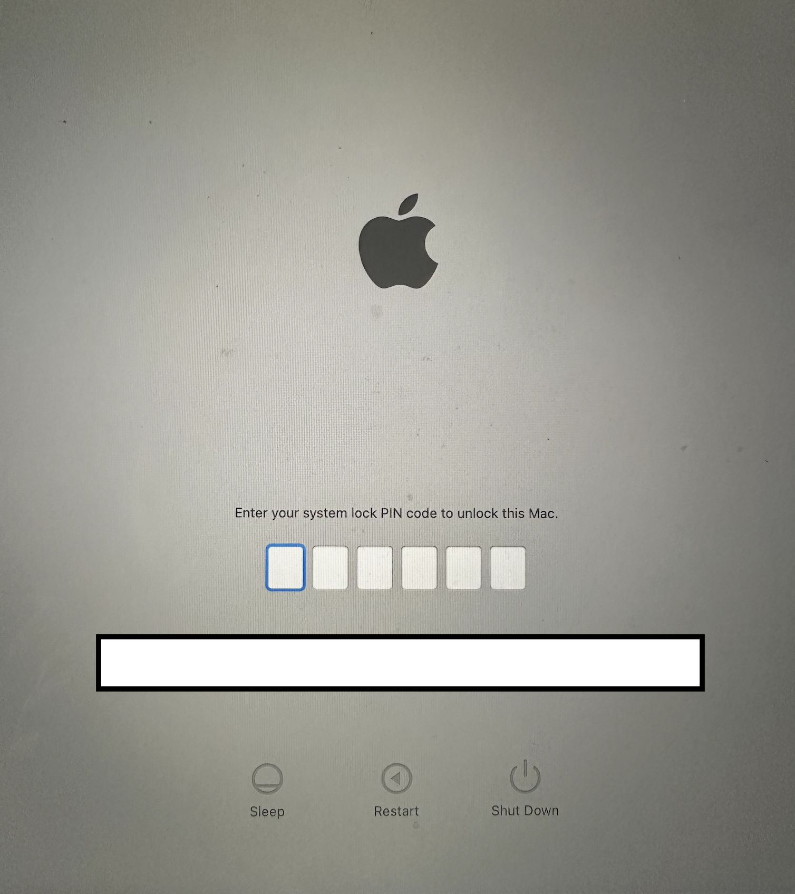
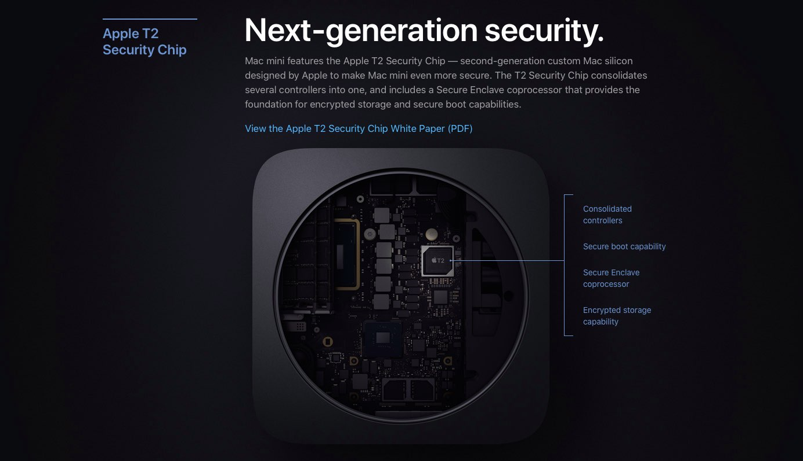
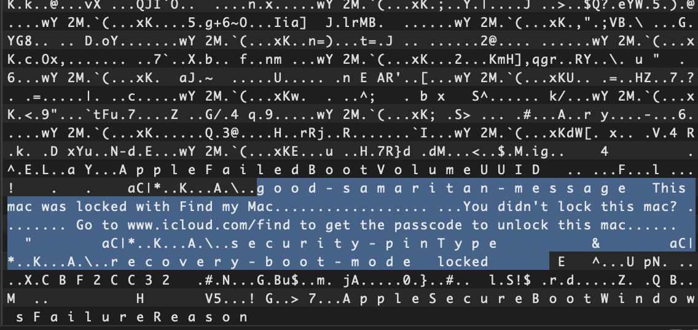

Read this post on your own risk! The information is based on my own research and my (not-so-good-yet) reverse engineering skills. Thus, this write-up might be incorrect, contains mistakes and turn out partially or completely wrong! Do not trust it blindly and DYOR :\)

First of all, what does EFI lock mean in context of macs?

EFI lock is enabled when a macbook is set to lost mode via Apple’s Find My protocol.

In this state, the device is unusable, it will boot straight to recovery mode and show us a white screen to enter a 6-digit passcode.

But how exactly is the technical background of this lock? Let’s find out.

When apple released Intel macbooks with T2 chip, the T2 system meant to be encapsulated from the rest “insecure” part of the mac system. 

Well, with the release of checkm8, this concept was absolete as we can easy jailbreak the T2 system via palera1n or boot a SSH ramdisk on it.

EFI configuration and other boot policies are stored in NVRAM on Intel macs, therefore we just need to reset the NVRAM and trigger a regeneration of it.

This is what is stored inside the NVRAM, the mac will be set to `recovery boot mode` and show the locked message from above.

To trigger the reset of NVRAM on T2, we can do it a very simple way:

1. Boot ramdisk
2. Mount t2 subsystem disks
3. Remove NVRAM file at path `/var/db/NVRAM_NEW.snapshot` 
Just delete it with the `rm -rf` command
4. Trigger the regeration with `MacEFIUtil -r`
5. Reboot

After this, there is no longer any `recovery boot mode` or passcode enabled and we can boot back into the usual macOS system - in case we have the password for the user account - if not, we can use the so-called *t2* *passcode bypass*, which will reset the macOS system and remove the installed accounts but without removing the activation tickets which keep the mac running without any icloud lock.

Extra tip: If you want to enable USB boot as well and disable secure boot, you can do this via those commands:

Disable secure boot policy

`nvram -m 94b73556-2197-4702-82a8-3e1337dafbfb:AppleSecureBootPolicy=%00`

Enable usb boots

`nvram -m 5eeb160f-45fb-4ce9-b4e3-610359abf6f8:StartupManagerPolicy=%03`

## Disclaimer

This writeup is for **educational purposes only**.

- Do **not** use this for illegal activities.
- Apple may patch this behavior at any time.

© 2025  ~ Hana Kim