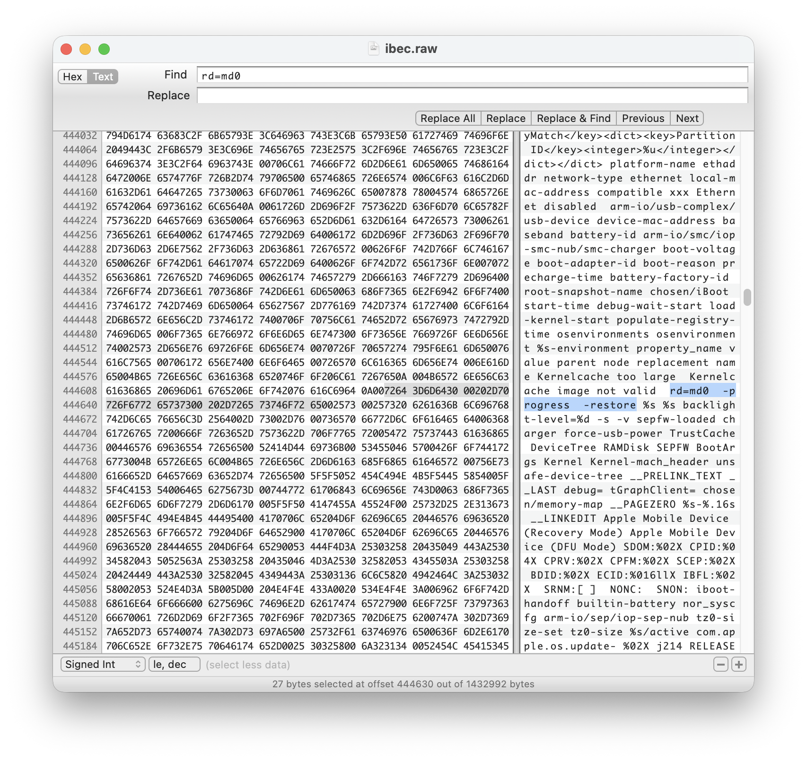

Requirements:

*Tools*

- [iBoot64Patcher](https://github.com/haiyuidesu/iBoot64Patcher) (alternative [kairos](https://github.com/dayt0n/kairos))
- [img4lib](https://github.com/xerub/img4lib)
- [img4tool](https://github.com/tihmstar/img4tool)
- [partialZipBrowser](https://github.com/tihmstar/partialZipBrowser)
- [tsschecker](https://github.com/tihmstar/tsschecker)

*Files & Devices*

- bridgeOS 6.1 iPSW (can be found on theiphonewiki.com, other versions may also work)
- USB-C to USB-C cable to connect mac to mac
- T2 Macbook (Intel mac with T8012 chip)
- second mac for exploitation
- t2 ssh tar bundle

### Download bootchain

```bash
# To list all files in iPSW
pzb -l <ipsw link here>

# To download the selected files
pzb -g <filepath here> <ipsw link here>

# In my case, i have a T2 j214kAP model

# List files
pzb -l https://updates.cdn-apple.com/2021WinterFCS/fullrestores/071-96473/C02F68E0-32FD-4211-8EDE-126AFBA8F361/iBridge2,1,iBridge2,10,iBridge2,12,iBridge2,14,iBridge2,15,iBridge2,16,iBridge2,19,iBridge2,20,iBridge2,21,iBridge2,22,iBridge2,3,iBridge2,4,iBridge2,5,iBridge2,6,iBridge2,7,iBridge2,8_6.1_19P647_Restore.ipsw

# iBSS
pzb -g Firmware/dfu/iBSS.j214k.RELEASE.im4p https://updates.cdn-apple.com/2021WinterFCS/fullrestores/071-96473/C02F68E0-32FD-4211-8EDE-126AFBA8F361/iBridge2,1,iBridge2,10,iBridge2,12,iBridge2,14,iBridge2,15,iBridge2,16,iBridge2,19,iBridge2,20,iBridge2,21,iBridge2,22,iBridge2,3,iBridge2,4,iBridge2,5,iBridge2,6,iBridge2,7,iBridge2,8_6.1_19P647_Restore.ipsw

# iBEC
pzb -g Firmware/dfu/iBEC.j214k.RELEASE.im4p https://updates.cdn-apple.com/2021WinterFCS/fullrestores/071-96473/C02F68E0-32FD-4211-8EDE-126AFBA8F361/iBridge2,1,iBridge2,10,iBridge2,12,iBridge2,14,iBridge2,15,iBridge2,16,iBridge2,19,iBridge2,20,iBridge2,21,iBridge2,22,iBridge2,3,iBridge2,4,iBridge2,5,iBridge2,6,iBridge2,7,iBridge2,8_6.1_19P647_Restore.ipsw

# devicetree
pzb -g Firmware/all_flash/DeviceTree.j214kap.im4p https://updates.cdn-apple.com/2021WinterFCS/fullrestores/071-96473/C02F68E0-32FD-4211-8EDE-126AFBA8F361/iBridge2,1,iBridge2,10,iBridge2,12,iBridge2,14,iBridge2,15,iBridge2,16,iBridge2,19,iBridge2,20,iBridge2,21,iBridge2,22,iBridge2,3,iBridge2,4,iBridge2,5,iBridge2,6,iBridge2,7,iBridge2,8_6.1_19P647_Restore.ipsw

# ramdisk
pzb -g 018-77804-055.dmg https://updates.cdn-apple.com/2021WinterFCS/fullrestores/071-96473/C02F68E0-32FD-4211-8EDE-126AFBA8F361/iBridge2,1,iBridge2,10,iBridge2,12,iBridge2,14,iBridge2,15,iBridge2,16,iBridge2,19,iBridge2,20,iBridge2,21,iBridge2,22,iBridge2,3,iBridge2,4,iBridge2,5,iBridge2,6,iBridge2,7,iBridge2,8_6.1_19P647_Restore.ipsw

# trustcache 

pzb -g Firmware/018-77804-055.dmg.trustcache https://updates.cdn-apple.com/2021WinterFCS/fullrestores/071-96473/C02F68E0-32FD-4211-8EDE-126AFBA8F361/iBridge2,1,iBridge2,10,iBridge2,12,iBridge2,14,iBridge2,15,iBridge2,16,iBridge2,19,iBridge2,20,iBridge2,21,iBridge2,22,iBridge2,3,iBridge2,4,iBridge2,5,iBridge2,6,iBridge2,7,iBridge2,8_6.1_19P647_Restore.ipsw

# kernel
pzb -g kernelcache.release.ibridge2p https://updates.cdn-apple.com/2021WinterFCS/fullrestores/071-96473/C02F68E0-32FD-4211-8EDE-126AFBA8F361/iBridge2,1,iBridge2,10,iBridge2,12,iBridge2,14,iBridge2,15,iBridge2,16,iBridge2,19,iBridge2,20,iBridge2,21,iBridge2,22,iBridge2,3,iBridge2,4,iBridge2,5,iBridge2,6,iBridge2,7,iBridge2,8_6.1_19P647_Restore.ipsw
```

### Get SHSH blob

### Sign devicetree & trustcache

```bash
# devicetree signing
img4tool -c devicetree.img4 -p DeviceTree.j214kap.im4p -s shsh.shsh2

# trustcache signing
img4tool -c trust.img4 -p 018-77804-055.dmg.trustcache -s shsh.shsh2
```

For the devicetree, we still need to change its tag from `dtre` to `rdtre`, we do this manually via hex editor. This way, our mac later recognize the file as `restore device tree`.


### Create iBSS and iBEC

```bash
# decrypt iBSS
gaster decrypt iBSS.j214k.RELEASE.im4p ibss.raw

# patch iBSS
iBoot64Patcher ibss.raw ibss.patched

# create image4
img4tool -c ibss.im4p -t ibss ibss.patched

# sign ibss
img4tool -c ibss.img4 -p ibss.im4p -s shsh.shsh2

# decrypt iBEC
gaster decrypt iBEC.j214k.RELEASE.im4p ibec.raw

# patch iBEC
iBoot64Patcher ibec.raw ibec.patched
```

In the iBEC, we still need to set the boot-args for our ramdisk.

1. Open ibec.patched into hexfiend
2. Search for `rd=md0`
3. Add boot-args `serial=3 -v wdt=-1`
    
    
    
    
    

```bash
# create image4
img4tool -c ibec.im4p -t ibec ibec.patched

# sign ibec
img4tool -c ibec.img4 -p ibec.im4p -s shsh.shsh2
```

### Ramdisk

First, we need to decode the ramdisk dmg file

This we do via img4lib

```bash
# extract dmg
img4 -i 018-77804-055.dmg -o ramdisk.dmg

# resize dmg
hdiutil resize -size 125m ramdisk.dmg
```

Then we need to insert our `t2ssh.tar` bundle into the ramdisk

```bash
# mount ramdisk
open ramdisk.dmg

# untar the bundle over our ramdisk
tar -xvf t2ssh.tar -C /Volumes/<mounted_ramdisk_volume_name_here>

# unmount ramdisk
umount /Volumes/<mounted_ramdisk_volume_name_here>
```

Now we need to create the `image4` of our ramdisk again

```bash
# create image4
img4tool -c ramdisk.im4p -t rdsk ramdisk.dmg

# sign ramdisk
img4tool -c ramdisk.img4 -p ramdisk.im4p -s shsh.shsh2
```

### Patching the kernelcache

This is probably the most complicated task here, in case you do it manually via IDA Pro at least.

First we need to extract the kernelcache from its image4 format.

```bash
img4 -i kernelcache.release.ibridge2p -o kcache.raw
```

This file `kcache.raw` we now load into IDA Pro. Just hit `Go` and drag and drop the kernelcache into the software.


Then you can start reversing and patching your kernelcache.

Step by step you can find in my youtube tutorial

http://www.youtube.com/watch?v=r5WRNJ_Btt8


### Booting the device

Booting is pretty straight forward with irecovery. You just have to run the gaster checkm8 exploit before sending the iBSS.

```bash
# run checkm8
./gaster pwn

# send ibss
irecovery -f ibss.img4 

# send ibss again (this is a bug of gaster that it doesn't accept first try, 
# so just do it)
irecovery -f ibss.img4

# send ibec
irecovery -f ibec.img4 

# load ibec
irecovery -c go

# send devicetree
irecovery -f devicetree.img4 

# load devicetree
irecovery -c devicetree

# send ramdisk
irecovery -f ramdisk.img4 

# load ramdisk
irecovery -c ramdisk

# send trustcache
irecovery -f trust.img4 

# load trustcache
irecovery -c firmware

# send kernelcache
irecovery -f kernel.img4 

# load kernelcache
irecovery -c bootx
```

Now, the SSH shell should be reachable. 

To connect to the device, first create a local port proxy using `iproxy`

In our case dropbear SSH is reachable at port 5555 on device. We redirect this to mac `localhost:2222`

```bash
iproxy 2222 5555
```

Connect SSH

```bash
ssh -p 2222 root@localhost

### enter password alpine now and you have your ssh working
```

---

## Disclaimer

This POC is for **educational purposes only**.

- Do **not** use this for illegal activities.
- Apple may patch this behavior at any time.


© 2025  ~ Hana Kim