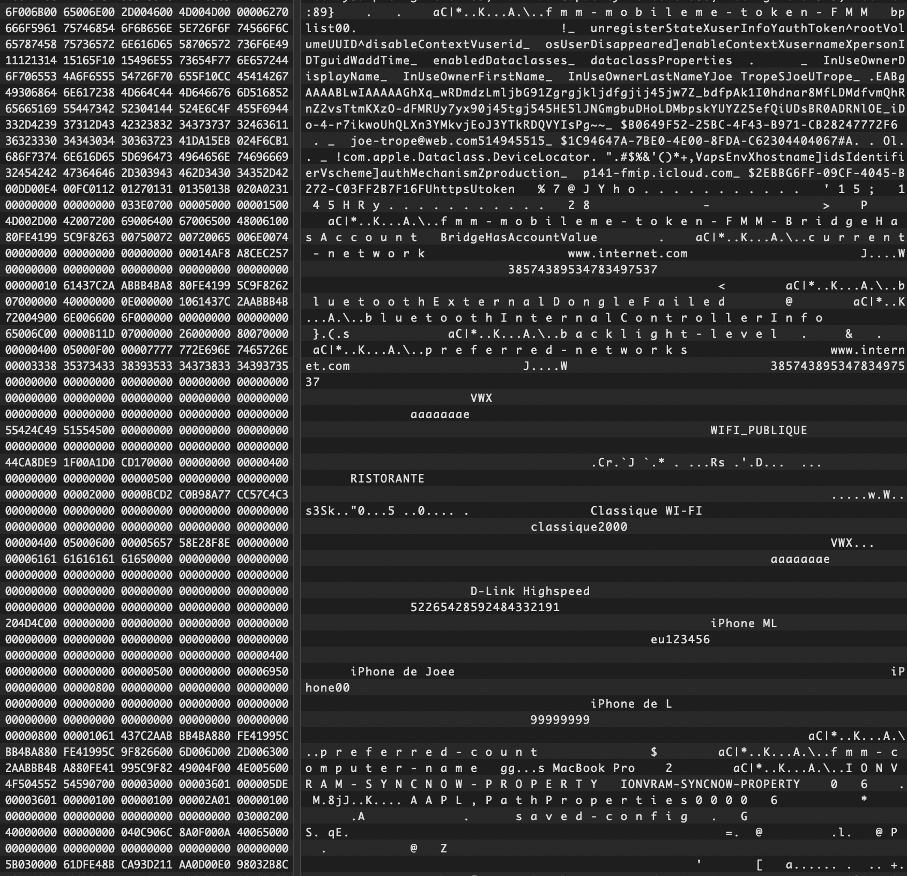

Read this post on your own risk! The information is based on my own research and my (not-so-good-yet) reverse engineering skills. Thus, this write-up might be incorrect, contains mistakes and turn out partially or completely wrong! Do not trust it blindly and DYOR :\)

## Introduction

When Apple introduced the T2 security chip in its Intel-based MacBooks and iMacs, it was marketed as a leap forward in protecting user data. The chip integrates multiple functions into a single secure enclave, covering areas such as encrypted storage, Touch ID, secure boot, and system management.

## Functionality of T8012

The T2 is essentially a system-on-chip (SoC) derived from Apple’s iWatch processor. It includes:

- **Secure Enclave Processor (SEP):** Handles encryption keys, Touch ID, and authentication process
- **Hardware Encryption for Storage:** Ensures that data on the SSD is tied cryptographically to the hardware, preventing raw disk swaps and data extraction.
- **Secure Boot:** Verifies that macOS is signed and untampered, blocking manipulated operating systems.
- **System Management Controller (SMC):** Manages power, temperature, and some other device-level resources.

In theory, this makes a device more resilient against tampering and forensic attacks. In theory ...

---

## Sensitive Data leak with NVRAM

NVRAM is a small region of persistent memory that stores system config data outside the main OS. Even with the T2 chip, NVRAM continues to hold critical information, such as:

- Startup disk prefs
- Display settings
- Volume settings
- Recovery mode variables

But NVRAM also holds **user-related data** that can persist across reboots and remain accessible even without OS-level privileges as the **NVRAM is not encrypted** by default. This means that anyone with physical access to the machine (e.g., through checkm8) can extract the info.

These are examples of sensitive information found in NVRAM...:

- **Apple ID / email** account email for the administrator account
- **User names and surnames** tied to account setup.
- **Wi-Fi network identifiers (SSIDs) and passwords** for previously joined networks.

Because this data is stored in plaintext, it poses a risk: attackers or forensic investigators can extract and analyze it without needing to defeat T2’s storage encryption.

The same sensitive account information can be found in the path `/var/containers/Data/System/9960E93D-2665-451C-9D3A-3B62AA98EE87/Library/Preferences/FMMAccount.plist.plist`

## Disclaimer

This writeup is for **educational purposes only**.

- Do **not** use this for illegal activities.
- Apple may patch this behavior at any time.

© 2025  ~ Hana Kim